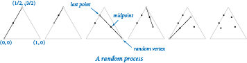
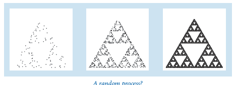

# Sierpinski 

### Iterated Function Systems
An iterated function system (IFS) is a general way to produce fractals like the Sierpinski triangle and the Barnsley
Fern. As a first example, consider the following simple process: start by plotting a point at one of the vertices of an
equilateral triangle. Then pick one of the three vertices at random and plot a new point halfway between the point just
plotted and that vertex. Continue performing the same operation.

A random process
The program sierpinski.py simulates this process. Below are snapshots after 1000, 10000, and 100000 steps. You might
recognize the figure as the Sierpinski triangle.

https://mathworld.wolfram.com/SierpinskiSieve.html

